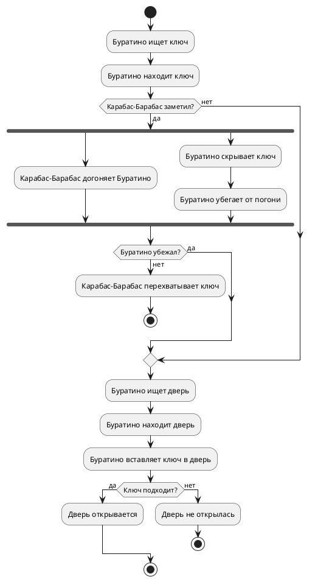

# Activity Diagram: Алгоритм системы "Золотой ключик"

## Обзор

Эта диаграмма активности показывает последовательность действий в системе "Золотой ключик" — от поиска ключа до открытия потайной двери.

## Описание потока

### Шаг 1: Поиск ключа
- Буратино ищет и находит артефакт Key

### Шаг 2: Столкновение с Карабасом-Барабасом
- Если Карабас-Барабас заметил Буратино — начинается параллельное действие:
  - **Карабас-Барабас** догоняет Буратино
  - **Буратино** скрывает ключ и убегает от погони
- Если Буратино **не убежал** — Карабас перехватывает ключ, конец
- Если Карабас **не заметил** — Буратино продолжает путь

### Шаг 3: Поиск двери
- Буратино ищет и находит скрытую дверь

### Шаг 4: Открытие двери
- Буратино вставляет ключ в дверь
- Если ключ подходит — дверь открывается
- Если ключ не подходит — дверь не открылась, конец

## Точки принятия решений

| Условие | Да | Нет |
|---------|-----|------|
| Карабас-Барабас заметил? | Погоня и параллельные действия | Буратино идёт к двери |
| Буратино убежал? | Продолжает путь | Карабас перехватывает ключ |
| Ключ подходит? | Дверь открывается | Дверь не открылась |

## Диаграмма

