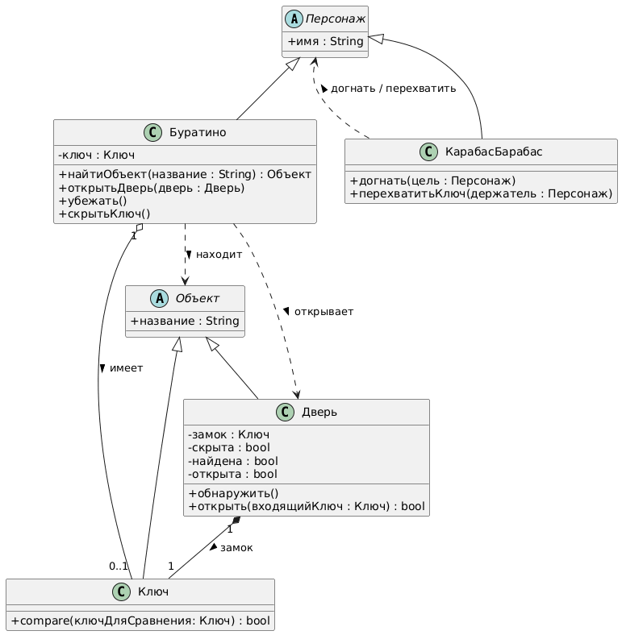
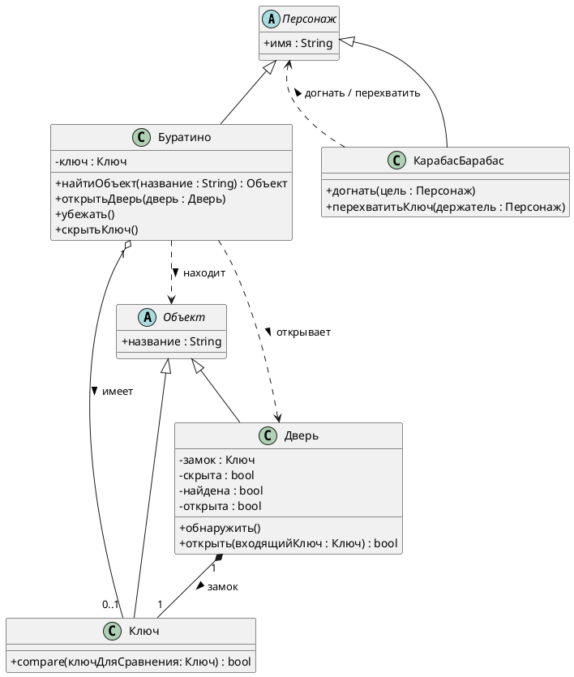

# Class Diagram: Золотой ключик

## Обзор

Эта диаграмма классов показывает объектно-ориентированную структуру системы аутентификации "Золотой ключик".

## Иерархия классов

### Иерархия Персонажей

| Class | Type | Attributes | Methods |
|-------|------|------------|---------|
| Персонаж | Abstract | + имя: String | - |
| Буратино | Concrete | - ключ: Ключ | + найтиОбъект(название : String) : Объект, + открытьДверь(дверь : Дверь), + убежать(), + скрытьКлюч() |
| Карабас-Барабас | Concrete | - | + догнать(цель : Персонаж), + перехватитьКлюч(держатель : Персонаж) |

### Иерархия объектов

| Class | Type | Attributes | Methods |
|-------|------|------------|---------|
| Объект | Abstract | + название: String | - |
| Ключ | Concrete | - | + compare(ключДляСравнения: Ключ) : bool |
| Дверь | Concrete | - замок : Ключ, - скрыта : bool, - найдена : bool, - открыта : bool | + обнаружить(), + открыть(входящийКлюч : Ключ) : bool |

## Связи

- **Буратино "1" o-- "0..1" Ключ**: имеет >
- **Дверь "1" *-- "1" Ключ***: замок >
- **КарабасБарабас ..> Персонаж**: догнать / перехватить >
- **Буратино ..> Дверь**: открывает >
- **Буратино ..> Объект**: находит >

## Диаграмма

