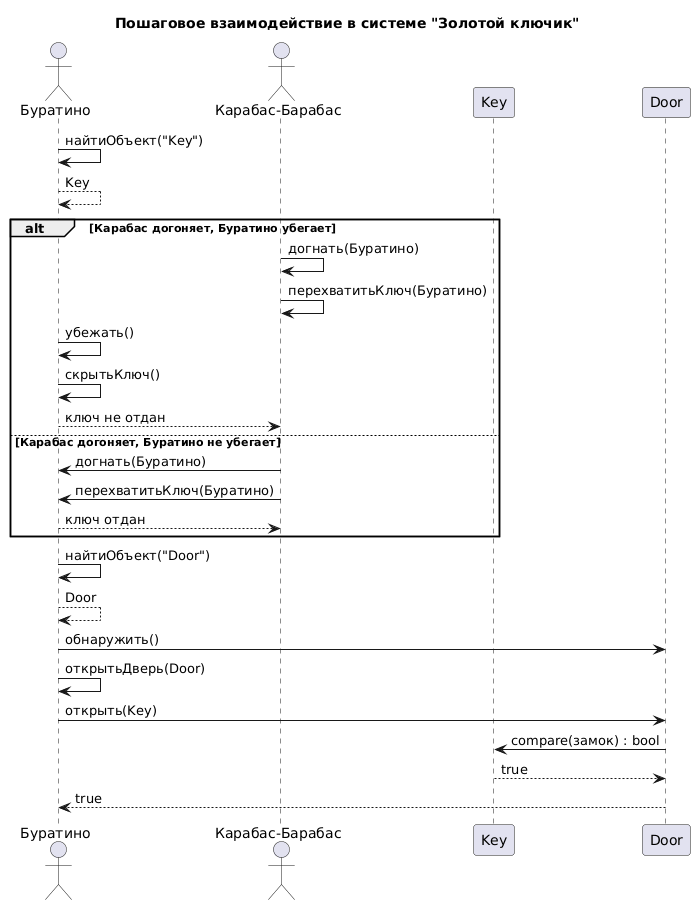
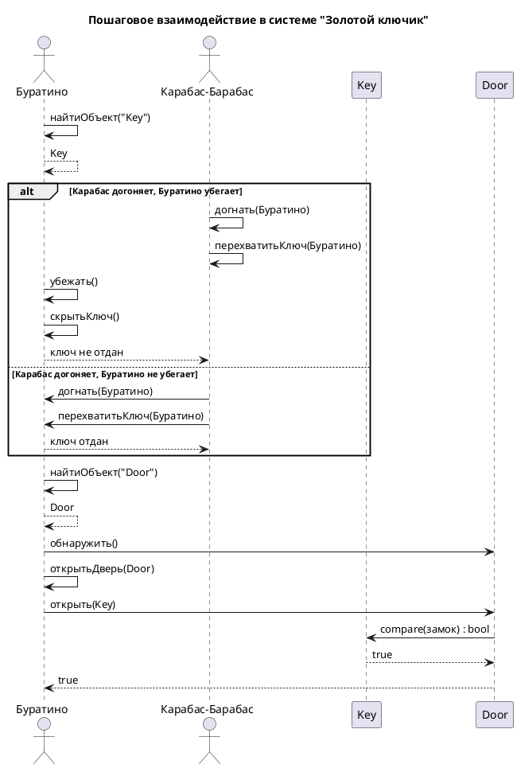

# Sequence Diagram: Взаимодействие в системе "Золотой ключик"

## Обзор

Эта диаграмма последовательности показывает пошаговое взаимодействие между актерами и объектами в системе "Золотой ключик".

## Актеры и участники

| Актер/Участник | Описание |
|-------------------|-------------|
| Буратино (B) | The main protagonist, puppet |
| Карабас-Барабас (KB) | The main antagonist  |
| Key (K) | A key for the hidden door |
| Door (D) | The hidden door |

## Interaction Steps

### Шаг 1: Поиск ключа
- Буратино находит ключ

### Шаг 2: Погоня
- Если Карабас догоняет, Буратино убегает:
  - **Карабас-Барабас** пытается догнать Буратино
  - **Карабас-Барабас** пытается перехватить ключ
  - **Буратино** убегает и скрывает ключ
  - Ключ не отдан
- Если Карабас догоняет, Буратино не убегает:
  - **Карабас-Барабас** догоняет Буратино
  - **Карабас-Барабас** перехватывает ключ
  - Ключ отдан

### Шаг 3: Поиск двери
- Буратино находит скрытую дверь
- Дверь становится обнаруженной

### Шаг 4: Открытие двери (финал)
- Буратино открывает дверь
- Ключ сверяется с отверстием замка (подходит ли ключ)
- Дверь отворяется

## Диаграмма

