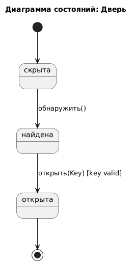
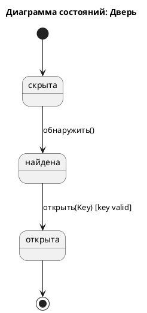

# State Diagram: Дверь

## Обзор

Эта диаграмма состояний показывает переходы между состояниями Двери.

## Состояния

| Состояние | Описание |
|-------|-------------|
| Скрыта | дверь ещё не обанаружена |
| Найдена | дверь обнаружена и готова к открытию |
| Открыта | дверь открыта и через неё можно пройти |

## Переходы состояний

### Начальное состояние
- [*] --> Скрыта 

### Переходы: 
- Из Скрыта в Найдена : обнаружить()
- Из Найдена в Открыта : открыть(Key) [key valid]

### Конечное состояние
- Открыта --> [*]

## Диаграмма

