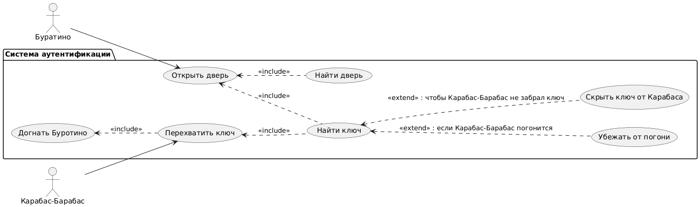

# Use Case Diagram: Управление золотыми активами

## Актеры

| Актер | Описание |
|-------|-------------|
| Буратино | Главный протагонист, пытается найти ключ для открытия двери, ведущей в театр |
| Карабас-Барабас | Главный антагонист, пытается перехватить ключ |

## Варианты использования

### Пакет: Система аутентификации

| Вариант использования | Описание |
|----------|-------------|
| Открыть дверь | открывает найденную дверь с помощью ключа |
| Перехватить ключ | попытка перехватить ключ у Буратино |

## Связи

### Актер к варианту использования

- **Буратино** выполняет: Открыть дверь
- **Карабас-Барабас** выполняет: Перехватить ключ

### Отношения Extend/Include

- **Открыть дверь** <.. **Найти дверь** (<<include>>)

- **Открыть дверь** <.. **Найти ключ** (<<include>>)
- **Найти ключ** <.. **Скрыть ключ от Карабаса** (<<extend>>) : чтобы Карабас-Барабас не забрал ключ
- **Найти ключ** <.. **Убежать от погони** (<<extend>>) :  если Карабас-Барабас погонится
  
- **Перехватить ключ** <.. **Найти ключ** (<<include>>)
- **Догнать Буратино** <.. **Перехватить ключ** (<<include>>)

## Диаграмма



```
@startuml
left to right direction

actor "Буратино" as Puppet
actor "Карабас-Барабас" as Karabas

package "Система аутентификации" {
  usecase "Убежать от погони" as RunAway
  usecase "Найти ключ" as FindKey
  usecase "Найти дверь" as FindDoor
  usecase "Открыть дверь" as OpenDoor
  usecase "Скрыть ключ от Карабаса" as HideKey
  usecase "Перехватить ключ" as InterceptKey
  usecase "Догнать Буротино" as CatchUp
}

' Основные независимые действия Буротино
Puppet --> OpenDoor

' Основные независимые действия Карабаса-Барабаса
Karabas --> InterceptKey

' Зависимости внутри системы
OpenDoor <.. FindDoor : <<include>>
OpenDoor <.. FindKey : <<include>>
FindKey <.. RunAway : <<extend>> : если Карабас-Барабас погонится
FindKey <.. HideKey : <<extend>> : чтобы Карабас-Барабас не забрал ключ

InterceptKey <.. FindKey : <<include>>
CatchUp <.. InterceptKey : <<include>>
@enduml
```

## Описание

Эта диаграмма вариантов использования иллюстрирует сценарий сказки, связанный с историей "Золотой ключик":

1. **Буратино** пытается найти золотой ключ, чтобы открыть потайную дверь, ведущую в театр
2. **Буратино** находит ключ
3. **Карабас-Барабас** замечает ключ
4. **Буратино** прячет ключ и убегает
5. **Буратино** открывает найденную дверь
